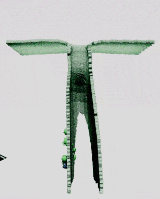
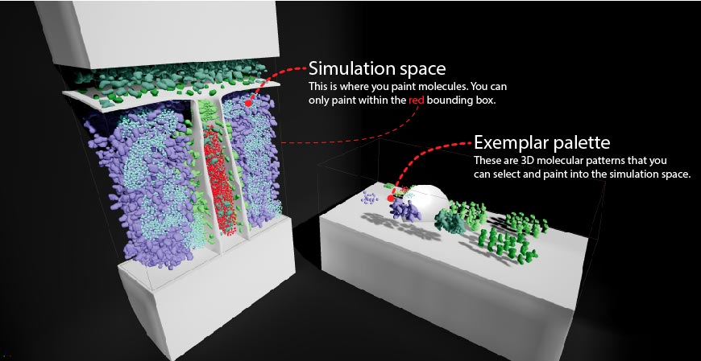
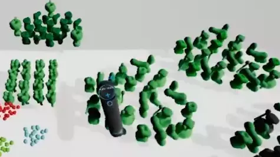
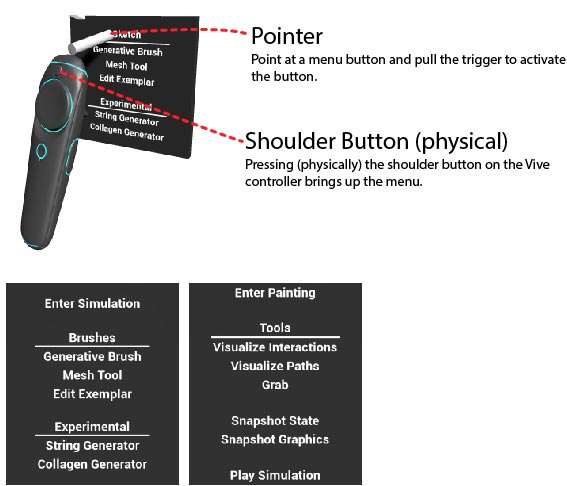
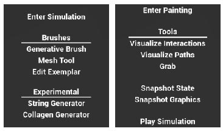

# LifeBrush


[LifeBrush is a VR environment](https://youtu.be/pMArGEEIW98) for creating interactive biomolecular illustrative simulations in the Unreal Engine 4 Editor. On the right is a clip showing a mitochondrion being painted and simulated within VR. 

The generative brush uses discrete element texture synthesis to generate molecules on surfaces and in space. We have also developed an agent-based modeling framework around our implementation of an Entity-Component-System (ECS) that can simulate 10,000 agents at 90 fps within Unreal. We bypass Unreal's traditional agent-component architecture to achieve that performance, we also use Nvidia's GPU Flex particle physics engines to process collisions on the GPU.

The C++ agent framework is based on an Entity-Component-System that we developed for Unreal Engine. Components are compact C++ structs. Entities organize multiple components into a single entity. We do not use Unreal's actor-component model because it cannot handle very large numbers of agents. Our ECS is the basis of our brush-based synthesis framework for painting agents and for simulating them.

This toolkit was originally described in a conference paper in 2018, "LifeBrush: Painting interactive agent-based simulations" by Timothy Davison, Faramarz Samavati and Christian Jacob (the BibTeX is below). The version here on GitHub is a significant evolution of that paper.

# Build instructions

Clone the repository and open the LifeBrush.uproject with Unreal Engine 4.18.

Requirements:
- Unreal Engine 4.18
- Windows 10
- At least an Nvidia GTX 1080
- HTC Vive

I haven't tested with an Oculus Rift, I'm pretty sure it won't work, but I would like to make it work someday.

# LifeBrush Tutorial Video

[Here is a tutorial on using the VR interface.](https://youtu.be/pMArGEEIW98)

# Using LifeBrush

> Bug: Unreal likes to switch controllers on me. So, I would suggest just using one controller and turning off the other one. I will fix some of the bugs that arise from this switching.

LifeBrush is designed to run within the Unreal Editor and not as a standalone program. Within the Unreal Editor, you use the VR preview mode to enter the painting environment. 

There are two demo levels, a bare mitochondrion ``mitochondrion_blank`` and one where the molecules have already been painted into a mitochondrial scene, ``mitochondrion_completed``. Both can be found in the ``Content\Mitochondrion`` folder within the Unreal Project.



The VR painting environment (above) contains a simulation space where you can paint molecules with a 3D generative brush using the Vive controller. The exemplar palette (exemplar is jargon from the literature) contains example molecular arrangements. LifeBrush uses these arrangements to synthesize new, non-repeating, arrangements of molecules in the simulation space that are similar to a selected example.


You can paint molecules on a surface (above) or in space. With the **Generative Brush** chosen press the top of the Vive controller trackpad to toggle between surface and volume (in 3D space) painting. The bottom part of the trackpad toggles between adding or removing elements. Squeeze the trigger to paint. How much you squeeze controls the size of the brush.



You select molecular patterns from the exemplar palette. With the **Generative Brush** chosen, move the end of the controller over an arrangement in the exemplar palette and squeeze the trigger to select the overlapping molecules. Pressing the top part of the trackpad once switches the mode to removing overlapping molecules from the selection.

New patterns are created in the exemplar palette within the 2D mouse-and-keyboard Unreal Editor. There is also an old broken editor within VR that allows you to create patterns in VR, but I will probably remove this feature.



LifeBrush is controlled by a clunky menu system (I would like to improve this in the future). Press the shoulder button (the button above the trackpad) to summon the VR menu. You point the "pointer cylinder" at the menu and squeeze the trigger to interact with the menu. Don't point the controller directly at the menu, it's weird, but you actually hold it a titled angle, it is more comfortable this way (and confusing to everyone I show LifeBrush to).



There are two modes, a painting mode, and simulation mode. Choose "Enter Simulation" to enter the simulation mode, this will change the menu options. You can go back to the painting mode with "Enter Painting".

In the simulation mode, use the Grab Tool to grab and move molecules about. You can also visualize agent path lines by choosing that tool and selecting some molecules, their spatial histories will be displayed. There is even a visualization tool for exploring events, such as ATP synthesis from ADP at an ATP-synthase molecule. These visualizations are described in an upcoming article.

# To Do

- Code examples
- Convert this to an Unreal Plugin instead of a project. It is still a project because hot reloading in Unreal sucks for plugins.
- Describe the mesh tool
- Fix the mesh tool
- Rethink and refactor the UI

# Bugs

The ``FGraph`` transaction API does not support removing a component and then adding a component in the same transaction. Do not do this:

```
FGraphNode& node = ...; // our node from somewhere

graph.beginTransaction();
node.removeComponent<FGraphMesh>(graph);
node.addComponent<FGraphMesh>(graph);
graph.endTransaction();
```

Without the transactions, this is possible.

# License and Copyright

All code, unless stated otherwise, is Copyright (c) 2019, Timothy Davison. All rights reserved.

All of my code is released under an MIT license. There are included source-codes released under their respective licenses.

**Please cite with:**
```
@inproceedings{davison2018lifebrush,
  title={LifeBrush: Painting interactive agent-based simulations},
  author={Davison, Timothy and Samavati, Faramarz and Jacob, Christian},
  booktitle={2018 International Conference on Cyberworlds (CW)},
  pages={17--24},
  year={2018},
  organization={IEEE}
}
```
